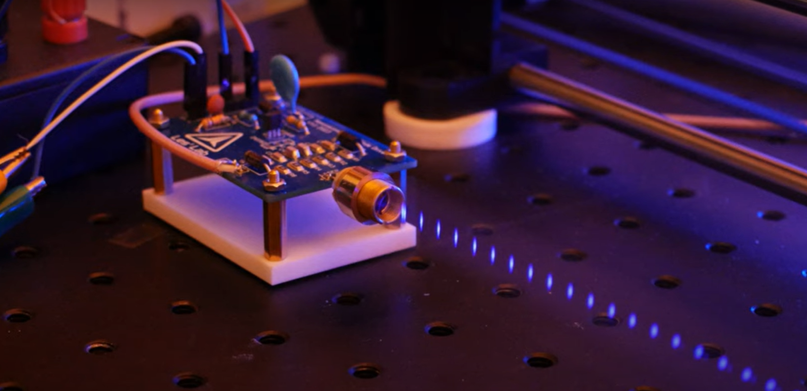
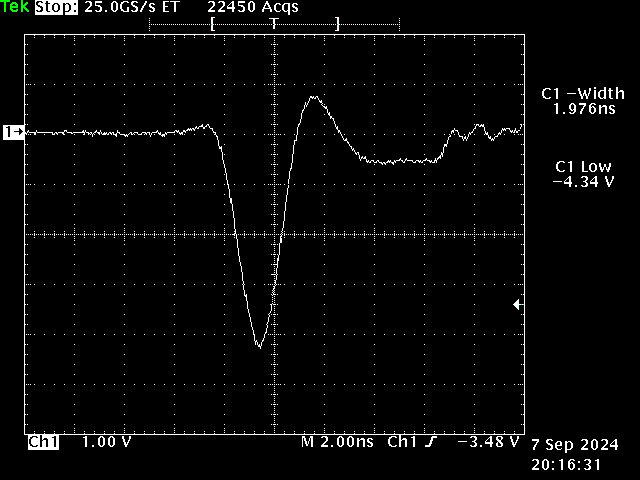
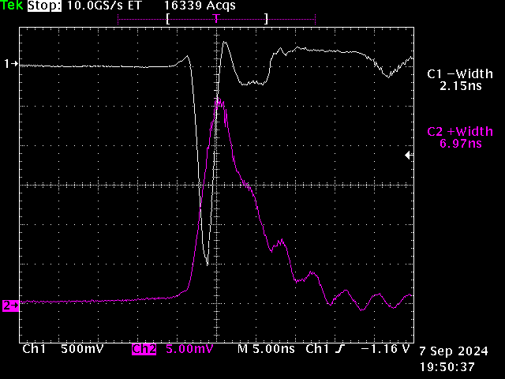

# Avalanche Laser Diode Driver

***Avalanche Laser Diode Driver***

This is a PCB for a home made Avalanche Laser diode driver.
This is capable of driving Laser diodes with high peak power, and nanosecond pulse duration.

There is a video on this topic here: https://youtu.be/3-htF8Jrixo

This has been verified with the following diodes:

M140  2W
NUBM05/08 3.5W
NUBM47 7W

***Requirements***

To use this circuit, you will need a high voltage power supply.
I used a small Nixie Tube inverter which are rally common on ebay. I replaced the onboard trimpot with a potentiomenter so that voltage could be varied from ~80v to 200v

You will also need a suitble functiona generator to trigger the pulser. The waveform should have a duration of 1uS and in my experience the Avalanache driver can be run from 1 hZ to over 10kHz without issues.

To measure current, you need a suitably fast oscilloscope (1GHz at least) with a 50 Ohm input impedence. The scaling is 10/500mV or 20A per volt.

***PCB***

This design is inspired by this paper, among others, but uses a common transistor in Avalanche mode to do the work!
https://www.researchgate.net/publication/321863583_Continuous_wave_laser_diodes_enable_fast_optoacoustic_imaging

The schematic above shows the overall deign of the Avalanche driver.
C1 through C6 are ceramic caps, 47pF each, rated at 500v. In my experiments I have used up to 8 (solder some of them double stacked) for a total of 376pF
R1-R6 form part of the pulse forming network, and are currently 0 ohm pending investigation.

There are two footprints for avalanche transistors, the 2N5192 (obsolete but widely avaiable for now) and the ZTX-415.
The ZTX-415 seems to have a lower threshold, and is capable of higher drive current than the 2N5192

Above is the board layout. This is inspired by commercial MOSFET drivers, and very wide traces are used throughout to minimize inductance.
The Gerbers for the PCB are available in this repo, so feel free to order some and experiment with this board"

***PCB***

All of the following diodes have been tested and work:
M140  2W
NUBM05/08 3.5W
NUBM47 7W

By far the best performer is the NUBM47. This is capable of being driven with 80+ AMPS of current, with peak output powers of 67 watts per pulse!
See this video here: https://youtu.be/3-htF8Jrixo

Above is a scope shot of the drive current, measured with a 1GHz Tek scope, and an input impedence of 50 Ohms.
The scaling is 20A/Volt, and so the current recorded here is 86.8 Amps with a duration of around 2nS.

Above is a scope shot of the optical output from the Laser diode. Channel 1 (top trace) is the Laser diode current.
The bottom trace is the output from a fast photodiode (picosecond risetime from Thorlabs). The optical pulse wth is 6.97ns.

